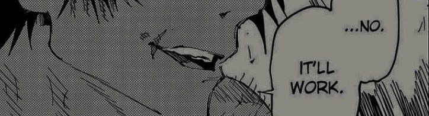
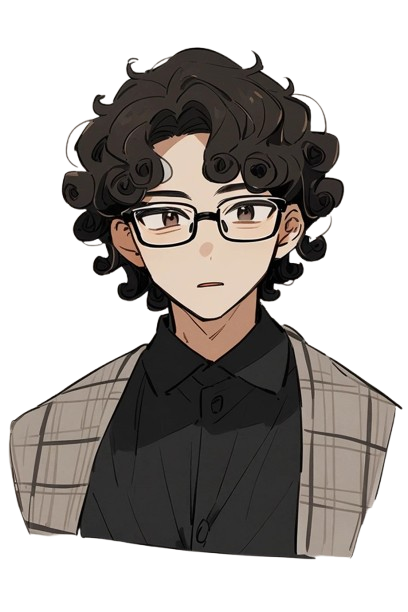

### 

### Hi there, I'm **Lakruwan**! 👋

🚀 **Undergraduate | Designer | Developer**

I'm a passionate **UI/UX beginner**, concept artist, game asset creator, and 3D modeler. I love crafting **Minecraft textures, game assets, and beautiful digital designs**. I also develop using modern tools! 💻✨

---

### 🛠 Tech & Tools I Use:

#### 🎨 **Design & Art**

  
  
  
  
  
  
  

#### 💻 **Development**

  
  
  
  
  
  
  

---

### 🎯 About Me:
- 🎨 Designing UI/UX (beginner) & digital artworks
- 🎮 Making **game asset packs** and **Minecraft textures**
- 🛠 Exploring **3D modeling** with Blender
- 🚀 Passionate about **creating aesthetic and functional designs**
- 🎮 Currently learning **Godot Engine** for game development

---

### 📈 GitHub Stats & Streaks:

  
  
  

### 🎵 Now Playing:

---

### 🤝 Connect with Me:

  
  
  

---

🔥 _Let's create something amazing together!_ 🔥
